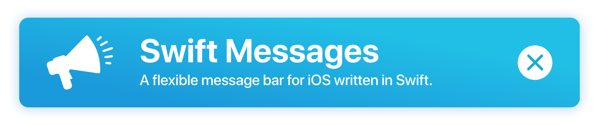
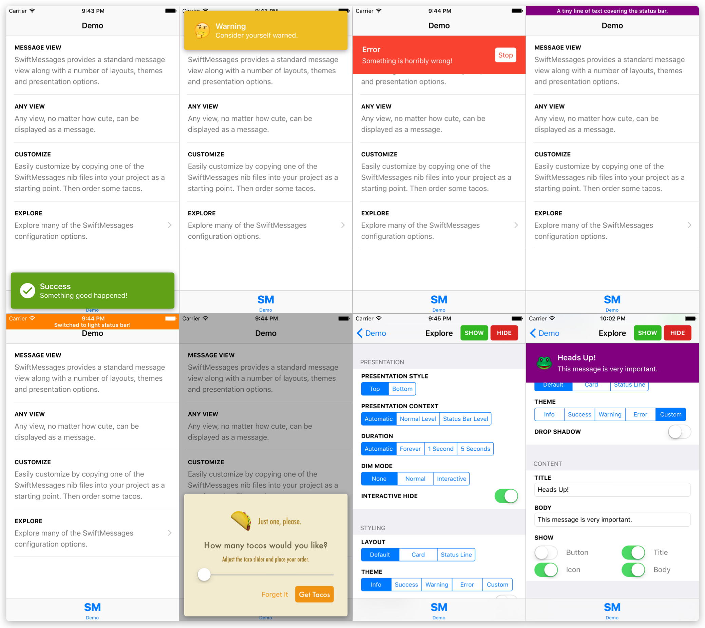
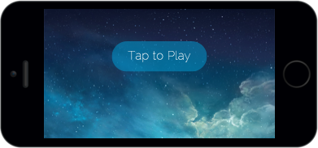
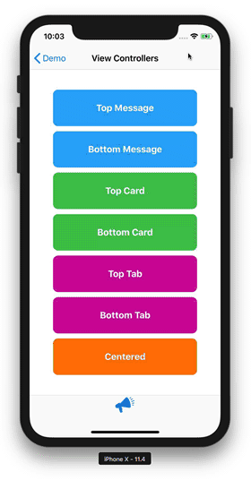

# SwiftMessages

[](https://twitter.com/TimothyMoose)
[](http://cocoadocs.org/docsets/SwiftMessages)
[](http://cocoadocs.org/docsets/SwiftMessages)
[](http://cocoadocs.org/docsets/SwiftMessages)
[](https://github.com/Carthage/Carthage)

<p align="center">
  
</p>

## Overview

SwiftMessages is a very flexible view and view controller presentation library for iOS.

Message views and view controllers can be displayed at the top, bottom, or center of the screen, over or under the status bar, or behind navigation bars and tab bars. There are interactive dismiss gestures including a fun, physics-based one. Multiple background dimming modes. And a lot more!

In addition to the numerous configuration options, SwiftMessages provides several good-looking layouts and themes. But SwiftMessages is also designer-friendly, which means you can fully and easily customize the view:

* Copy one of the included nib files into your project and change it.
* Subclass `MessageView` and add elements, etc.
* Or just supply an arbitrary instance of `UIView`.

Try exploring [the demo app via appetize.io](http://goo.gl/KXw4nD) to get a feel for the extensive configurability of SwiftMessages.

<p align="center">
  
</p>

<p align="center">
	<a href="http://goo.gl/KXw4nD"></a>
</p>

## View Controllers

SwiftMessages can present view controllers using the `SwiftMessagesSegue` custom modal segue!

<p align="center">
  
</p>

[`SwiftMessagesSegue`](./SwiftMessages/SwiftMessagesSegue.swift) is a subclass of `UIStoryboardSegue` that integrates directly into Interface Builder as a custom modal segue, enabling view controllers to take advantage of SwiftMessages layouts, animations and more. `SwiftMessagesSegue` works with any UIKIt project — storyboards are not required. Refer to the View Controllers readme below for more information.

#### [View Controllers Readme](./ViewControllers.md)

And check out our blog post [Elegant Custom UIViewController Transitioning](http://www.swiftkickmobile.com/elegant-custom-uiviewcontroller-transitioning-uiviewcontrollertransitioningdelegate-uiviewcontrolleranimatedtransitioning/) to learn a great technique you can use to build your own custom segues that utilize `UIViewControllerTransitioningDelegate` and `UIViewControllerAnimatedTransitioning`.

## Installation

### CocoaPods

Add the following line to your Podfile:

````ruby
pod 'SwiftMessages'
````

### Carthage

Add the following line to your Cartfile:

````ruby
github "SwiftKickMobile/SwiftMessages"
````

### Manual

1. Put SwiftMessages repo somewhere in your project directory.
1. In Xcode, add `SwiftMessages.xcodeproj` to your project.
1. On your app's target, add the SwiftMessages framework:
   1. as an embedded binary on the General tab.
   1. as a target dependency on the Build Phases tab.

## Usage

### Basics

````swift
SwiftMessages.show(view: myView)
````

Although you can show any instance of `UIView`, SwiftMessages provides a `MessageView` class
and assortment of nib-based layouts that should handle most cases:

````swift
// Instantiate a message view from the provided card view layout. SwiftMessages searches for nib
// files in the main bundle first, so you can easily copy them into your project and make changes.
let view = MessageView.viewFromNib(layout: .cardView)

// Theme message elements with the warning style.
view.configureTheme(.warning)

// Add a drop shadow.
view.configureDropShadow()

// Set message title, body, and icon. Here, we're overriding the default warning
// image with an emoji character.
let iconText = ["🤔", "😳", "🙄", "😶"].sm_random()!
view.configureContent(title: "Warning", body: "Consider yourself warned.", iconText: iconText)

// Increase the external margin around the card. In general, the effect of this setting
// depends on how the given layout is constrained to the layout margins.
view.layoutMarginAdditions = UIEdgeInsets(top: 20, left: 20, bottom: 20, right: 20)

// Reduce the corner radius (applicable to layouts featuring rounded corners).
(view.backgroundView as? CornerRoundingView)?.cornerRadius = 10

// Show the message.
SwiftMessages.show(view: view)
````

You may wish to use the view provider variant `show(viewProvider:)` to ensure that
your UIKit code is executed on the main queue:

````swift
SwiftMessages.show {
    let view = MessageView.viewFromNib(layout: .cardView)
    // ... configure the view
    return view
}
````

The `SwiftMessages.Config` struct provides numerous configuration options that can be passed to `show()`:

````swift
var config = SwiftMessages.Config()

// Slide up from the bottom.
config.presentationStyle = .bottom

// Display in a window at the specified window level: UIWindow.Level.statusBar
// displays over the status bar while UIWindow.Level.normal displays under.
config.presentationContext = .window(windowLevel: .statusBar)

// Disable the default auto-hiding behavior.
config.duration = .forever

// Dim the background like a popover view. Hide when the background is tapped.
config.dimMode = .gray(interactive: true)

// Disable the interactive pan-to-hide gesture.
config.interactiveHide = false

// Specify a status bar style to if the message is displayed directly under the status bar.
config.preferredStatusBarStyle = .lightContent

// Specify one or more event listeners to respond to show and hide events.
config.eventListeners.append() { event in
    if case .didHide = event { print("yep") }
}

SwiftMessages.show(config: config, view: view)
````

Specify default configuration options:

````swift
SwiftMessages.defaultConfig.presentationStyle = .bottom

// Show message with default config.
SwiftMessages.show(view: view)

// Customize config using the default as a base.
var config = SwiftMessages.defaultConfig
config.duration = .forever
SwiftMessages.show(config: config, view: view)
````

### Accessibility

SwiftMessages provides excellent VoiceOver support out-of-the-box.

* The title and body of the message are combined into a single announcement when the message is shown. The `MessageView.accessibilityPrefix` property can be set to prepend additional clarifying text to the announcement.

    Sometimes, a message may contain important visual cues that aren't captured in the title or body. For example, a message may rely on a yellow background to convey a warning rather than having the word "warning" in the title or body. In this case, it might be helpful to set `MessageView.accessibilityPrefix = "warning"`.
    
* If the message is shown with a dim view using `config.dimMode`, elements below the dim view are not focusable until the message is hidden. If `config.dimMode.interactive == true`, the dim view itself will be focusable and read out "dismiss" followed by "button". The former text can be customized by setting the `config.dimModeAccessibilityLabel` property.

See the `AccessibleMessage` protocol for implementing proper accessibility support in custom views.

### Message Queueing

You can call `SwiftMessages.show()` as many times as you like. SwiftMessages maintains a queue and shows messages one at a time. If your view implements the `Identifiable` protocol (like `MessageView`), duplicate messages will be removed automatically. The pause between messages can be adjusted:

````swift
SwiftMessages.pauseBetweenMessages = 1.0
````

There are a few ways to hide messages programatically:

````swift
// Hide the current message.
SwiftMessages.hide()

// Or hide the current message and clear the queue.
SwiftMessages.hideAll()

// Or for a view that implements `Identifiable`:
SwiftMessages.hide(id: someId)

// Or hide when the number of calls to show() and hideCounted(id:) for a 
// given message ID are equal. This can be useful for messages that may be
// shown from  multiple code paths to ensure that all paths are ready to hide.
SwiftMessages.hideCounted(id: someId)
````

Multiple instances of `SwiftMessages` can be used to show more than one message at a time. Note that the static `SwiftMessages.show()` and other static APIs on `SwiftMessage` are just convenience wrappers around the shared instance `SwiftMessages.sharedInstance`). Instances must be retained, thus it should be a property of something (e.g. your view controller):

````swift
class SomeViewController: UIViewController {
    let otherMessages = SwiftMessages()	
	
    func someMethod() {
        SwiftMessages.show(...)
        otherMessages.show(...)
    }
}
````

### Retrieving Messages

There are several APIs available for retrieving messages that are currently being shown, hidden, or queued to be shown. These APIs are useful for updating messages
when some event happens without needing to keep temporary references around.
See also `eventListeners`.

````swift
// Get a message view with the given ID if it is currently 
// being shown or hidden.
if let view = SwiftMessages.current(id: "some id") { ... }

// Get a message view with the given ID if is it currently 
// queued to be shown. 
if let view = SwiftMessages.queued(id: "some id") { ... }

// Get a message view with the given ID if it is currently being
// shown, hidden or in the queue to be shown.
if let view = SwiftMessages.currentOrQueued(id: "some id") { ... }
````

### Customization

SwiftMessages can display any `UIView`. However, there are varying degrees of customization that can be done to the bundled views.

#### Nib Files

All of the message designs bundled with SwiftMessages have associated nib files. You are encouraged to copy any of these nib files into your project and modify them to suit your needs. SwiftMessages will load your copy of the file instead of the original. Nib files may be copied in Xcode using drag-and-drop.

To facilitate the use of nib-based layouts, `MessageView` provides some type-safe convenience methods for loading the bundled nibs:

````swift
let view = MessageView.viewFromNib(layout: .cardView)
````

In addition, the `SwiftMessages` class provides some generic loading methods:

````swift
// Instantiate MessageView from a named nib.
let view: MessageView = try! SwiftMessages.viewFromNib(named: "MyCustomNib")

// Instantiate MyCustomView from a nib named MyCustomView.nib.
let view: MyCustomView = try! SwiftMessages.viewFromNib()
````

#### MessageView Class


[`MessageView`](./SwiftMessages/MessageView.swift) is a light-weight view that all of the bundled designs use. It primarily consists of the following optional `@IBOutlet` properties:

Element | Declaration | Description
--------|-----------|-----
Title | `titleLabel: UILabel?` | The message title.
Message body | `bodyLabel: UILabel?` |  The body of the message.
Image icon | `iconImageView: UIImageView?` | An image-based icon.
Text icon | `iconLabel: UILabel?` |  A text-based (emoji) alternative to the image icon.
Button | `button: UIButton?` | An action button.

The SwiftMessages nib file use `MessageView` as the top-level view with content connected to these outlets. The layouts are done using stack views, which means that you can remove an element by simply hiding it:

````swift
view.titleLabel.isHidden = true
````

A common mistake is attempting to remove an element by setting the corresponding outlet to `nil`. This does not work because it does not remove the element from the view hierarchy.

#### Configuration

`MessageView` provides numerous methods that follow the `configure*` naming convention:

````swift
view.configureTheme(.warning)
view.configureContent(title: "Warning", body: "Consider yourself warned.", iconText: "🤔")
````

All of these methods are shortcuts for quickly configuring the underlying view properties. SwiftMessages strives to avoid doing any internal magic in these methods, so you do not need to call them. You can configure the view properties directly or combine the two approaches.

#### Interaction

`MessageView` provides an optional block-based tap handler for the button and another for the view itself:

````swift
// Hide when button tapped
messageView.buttonTapHandler = { _ in SwiftMessages.hide() }

// Hide when message view tapped
messageView.tapHandler = { _ in SwiftMessages.hide() }
````

#### Extending

The suggested method for starting with `MessageView` as a base and __adding new elements__, such as additional buttons, is as follows:

  1. Copy one of the bundled nib files into your project or create a new one from scratch.
  1. Add new elements to the nib file.
  1. Sublcass `MessageView` and create outlets for the new elements.
  1. Assign the top-level view in the nib file to the subclass.
  1. Connect outlets between the nib file and the subclass.
  1. (recommended) override the implementation of `Identifiable` as needed to incorporate new elements into the message's identity.
  1. (recommended) override the implementation of `AccessibleMessage` as needed to incorporate new elements into Voice Over.
  1. Use one of the nib-loading methods above to load the view.

#### BaseView Class

[`BaseView`](./SwiftMessages/BaseView.swift) is the superclass of `MessageView` and provides numerous options that aren't specific to the "title + body + icon + button" design of `MessageView`. Custom views that are significantly different from `MessageView`, such as a progress indicator, should subclass `BaseView`.

#### CornerRoundingView Class

[`CornerRoundingView`](./SwiftMessages/CornerRoundingView.swift) is a custom view that messages can use for rounding all or a subset of corners with squircles (the smoother method of rounding corners that you see on app icons). The nib files that feature rounded corners have `backgroundView` assigned to a `CornerRoundingView`. It provides a `roundsLeadingCorners` option to dynamically round only the leading corners of the view when presented from top or bottom (a feature used for the tab-style layouts).

#### Animator Protocol

[`Animator`](./SwiftMessages/Animator.swift) is the protocol that SwiftMessages uses for presentation and dismissal animations. Custom animations can be done through the `SwiftMessages.PresentationStyle.custom(animator:)`. Some related components:
* [`TopBottomAnimation`](./SwiftMessages/TopBottomAnimation.swift) is a sliding implementation of `Animator` used internally by `.top` and `.bottom` presentation styles. It provides some customization options.
* [`PhysicsAnimation`](./SwiftMessages/PhysicsAnimation.swift) is a scaling + opacity implementation of `Animator` used internally by the `.center` presentation style. It provides a fun physics-based dismissal gesture and provides customization options including `.top` and `.bottom` placement.
* [`PhysicsPanHandler`](./SwiftMessages/PhysicsPanHandler.swift) provides the physics-based dismissal gesture for `PhysicsAnimation` and can be incorporated into other `Animator` implementations.

High-quality PRs for cool `Animator` implementations are welcome!

#### MarginAdjustable Protocol

[`MarginAdjustable`](./SwiftMessages/MarginAdjustable.swift) is a protocol adopted by `BaseView`. If the view being presented adopts `MarginAdjustable`, SwiftMessages takes ownership of the view's layout margins to ensure ideal spacing across the full range of presentation contexts.

#### BackgroundViewable Protocol

[`BackgroundViewable`](./SwiftMessages/BackgroundViewable.swift) is a protocol adopted by `BaseView` and requires that a view provide a single `backgroundView` property. `BaseView` initializes `backgroundView = self`, which you can freely re-assign to any subview.

If the view being presented adopts `BackgroundViewable`, SwiftMessages will ignore touches outside of `backgroundView`. This is important because message views always span the full width of the device. Card and tab-style layouts appear inset from the edges of the device because the message view's background is transparent and `backgroundView` is assigned to a subview constrained to the layout margins. In these layouts, touches in the transparent margins should be ignored.

#### Identifiable Protocol

[`Identifiable`](./SwiftMessages/Identifiable.swift) is a protocol adopted by `MessageView` and requires that a view provide a single `id` property, which SwiftMessages uses for message deduplication.

`MessageView` computes the `id` based on the message content, but `id` can also be set explicitly as needed.

#### AccessibleMessage Protocol

[`AccessibleMessage`](./SwiftMessages/AccessibleMessage.swift) is a protocol adopted by `MessageView`. If the view being presented adopts `AccessibleMessage`, SwiftMessages provides improved Voice Over.


## About SwiftKick Mobile
We build high quality apps! [Get in touch](http://www.swiftkickmobile.com) if you need help with a project.

## License

SwiftMessages is distributed under the MIT license. [See LICENSE](./LICENSE.md) for details.
