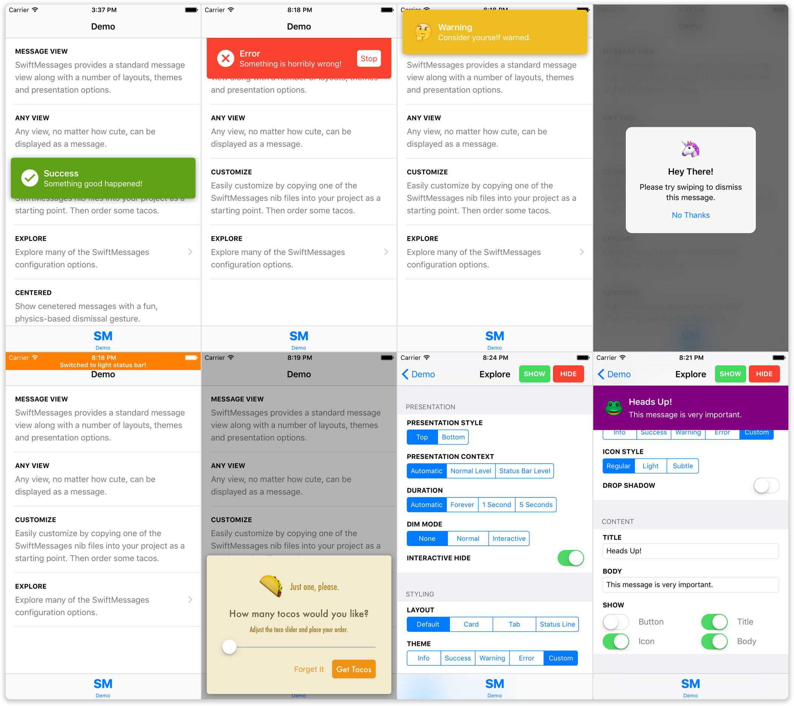

### 🔥 SwiftMessages 3.4.0 now supports centered messages!

# SwiftMessages

[](https://twitter.com/TimothyMoose)
[](http://cocoadocs.org/docsets/SwiftMessages)
[](http://cocoadocs.org/docsets/SwiftMessages)
[](http://cocoadocs.org/docsets/SwiftMessages)
[](https://github.com/Carthage/Carthage)

SwiftMessages is a message view library for iOS. It's very flexible. And written in Swift.

Message views can be displayed at the top, bottom, or center of the screen, over or under the status bar, or behind navigation bars and tab bars. There's an interactive dismiss gesture. You can dim the background if you like. And a lot more!

In addition to the numerous configuration options, SwiftMessages provides several good-looking layouts and themes. But SwiftMessages is also designer-friendly, which means you can fully and easily customize the view:

* Copy one of the included nib files into your project and change it.
* Subclass `MessageView` and add elements, etc.
* Or just supply an arbitrary instance of `UIView`.

Try exploring [the demo app via appetize.io](http://goo.gl/KXw4nD) to get a feel for the extensive configurability of SwiftMessages.

<p align="center">
  
</p>

<p align="center">
	<a href="http://goo.gl/KXw4nD"></a>
</p>

## Installation

### CocoaPods

Add one of the following lines to your Podfile depending on your Swift version:

````ruby
# Swift 3.0 - Xcode 8
pod 'SwiftMessages'
````
__Note that the minimum CocoaPods version is 1.1.0__.

### Carthage

Add one of the following lines to your Cartfile depending on your Swift version:

````ruby
# Swift 3.0 - Xcode 8
github "SwiftKickMobile/SwiftMessages"
````

## Usage

### Basics

````swift
SwiftMessages.show(view: myView)
````

Although you can show any instance of `UIView`, SwiftMessages provides a `MessageView` class
and assortment of nib-based layouts that should handle most cases:

````swift
// Instantiate a message view from the provided card view layout. SwiftMessages searches for nib
// files in the main bundle first, so you can easily copy them into your project and make changes.
let view = MessageView.viewFromNib(layout: .CardView)

// Theme message elements with the warning style.
view.configureTheme(.warning)

// Add a drop shadow.
view.configureDropShadow()

// Set message title, body, and icon. Here, we're overriding the default warning
// image with an emoji character.
let iconText = ["🤔", "😳", "🙄", "😶"].sm_random()!
view.configureContent(title: "Warning", body: "Consider yourself warned.", iconText: iconText)

// Show the message.
SwiftMessages.show(view: view)
````

You may wish to use the view provider variant `show(viewProvider:)` to ensure that
your UIKit code is executed on the main queue:

````swift
SwiftMessages.show {
    let view = MessageView.viewFromNib(layout: .CardView)
    // ... configure the view
    return view
}
````

The `SwiftMessages.Config` struct provides numerous configuration options that can be passed to `show()`:

````swift
var config = SwiftMessages.Config()

// Slide up from the bottom.
config.presentationStyle = .bottom

// Display in a window at the specified window level: UIWindowLevelStatusBar
// displays over the status bar while UIWindowLevelNormal displays under.
config.presentationContext = .window(windowLevel: UIWindowLevelStatusBar)

// Disable the default auto-hiding behavior.
config.duration = .forever

// Dim the background like a popover view. Hide when the background is tapped.
config.dimMode = .gray(interactive: true)

// Disable the interactive pan-to-hide gesture.
config.interactiveHide = false

// Specify a status bar style to if the message is displayed directly under the status bar.
config.preferredStatusBarStyle = .lightContent

// Specify one or more event listeners to respond to show and hide events.
config.eventListeners.append() { event in
    if case .didHide = event { print("yep") }
}

SwiftMessages.show(config: config, view: view)
````

Specify default configuration options:

````swift
SwiftMessages.defaultConfig.presentationStyle = .bottom

// Show message with default config.
SwiftMessages.show(view: view)

// Customize config using the default as a base.
var config = SwiftMessages.defaultConfig
config.duration = .forever
SwiftMessages.show(config: config, view: view)
````

### Accessibility

SwiftMessages provides excellent VoiceOver support out-of-the-box.

* The title and body of the message are combined into a single announcement when the message is shown. The `MessageView.accessibilityPrefix` property can be set to prepend additional clarifying text to the announcement.

    Sometimes, a message may contain important visual cues that aren't captured in the title or body. For example, a message may rely on a yellow background to convey a warning rather than having the word "warning" in the title or body. In this case, it might be helpful to set `MessageView.accessibilityPrefix = "warning"`.
    
* If the message is shown with a dim view using `config.dimMode`, elements below the dim view are not focusable until the message is hidden. If `config.dimMode.interactive == true`, the dim view itself will be focusable and read out "dismiss" followed by "button". The former text can be customized by setting the `config.dimModeAccessibilityLabel` property.

See the `AccessibleMessage` protocol for implementing proper accessibility support in custom views.

### Customization

`MessageView` provides the following UI elements, exposed as public, optional `@IBOutlets`:

* __Title__ (`UILabel`)
* __Message body__ (`UILabel`)
* __Image Icon__ (`UIImageView`)
* __Text Icon__ (`UILabel`)
* __Button__ (`UIButton`)

Because they are optional, you can freely omit the ones you don't need.

**The easiest way to customize `MessageView` is to drag-and-drop one of the pre-defined nib files into your project and make changes.** SwiftMessages always searches the main bundle for nib files first, so it is not necessary to rename the file or make a different API call. However, there are some OS-specific considerations to be aware of:

* **iOS 9+** When using one of the `UIStackView` layouts, MessageView.nib, CardView.nib or TabView.nib, as a starting point, you can simply delete elements from the nib file or hide them — no need to adjust the Auto Layout constraints.
* **iOS 8** When using MessageViewIOS8.nib, you'll delete the unwanted elements and fix up the Auto Layout constraints. Or just create your own nib from scratch, which is much like creating a custom `UITableViewCell` or `UICollectionViewCell` — set the base view's class to `MessageView` or whatever subclass or view class you're using and wire up the outlets.

To facilitate the use of nib-based layouts, `MessageView` provides some type-safe convenience methods for loading the pre-defined nibs:

````swift
// Instantiate MessageView from one of the provided nibs in a type-safe way.
// SwiftMessages searches the main bundle first, so you easily copy the nib into
// your project and modify it while still using this type-safe call.
let view = MessageView.viewFromNib(layout: .CardView)
````

In addition, the `SwiftMessages` class provides some generic loading methods:

````swift
// Instantiate MessageView from a named nib.
let view: MessageView = try! SwiftMessages.viewFromNib(named: "MyCustomNib")

// Instantiate MyCustomView from a nib named MyCustomView.nib.
let view: MyCustomView = try! SwiftMessages.viewFromNib()
````

`MessageView` provides an optional block-based tap handler for the button and another for the view itself:

````swift
// Hide when button tapped
messageView.buttonTapHandler = { _ in SwiftMessages.hide() }

// Hide when message view tapped
messageView.tapHandler = { _ in SwiftMessages.hide() }
````

### Message Queueing

You can call `SwiftMessages.show()` as many times as you like. SwiftMessages maintains a queue and shows messages one at a time. If your view implements the `Identifiable` protocol (like `MessageView`), duplicate messages will be removed automatically. The pause between messages can be adjusted:

````swift
SwiftMessages.pauseBetweenMessages = 1.0
````

There are a few ways to hide messages programatically:

````swift
// Hide the current message.
SwiftMessages.hide()

// Or hide the current message and clear the queue.
SwiftMessages.hideAll()

// Or for a view that implements `Identifiable`:
SwiftMessages.hide(id: someId)
````

Multiple instances of `SwiftMessages` can be used to show more than one message at a time. Note that the static `SwiftMessages.show()` and other static APIs on `SwiftMessage` are just convenience wrappers around the shared instance `SwiftMessages.sharedInstance`):

````swift
let otherMessages = SwiftMessages()
SwiftMessages.show(...)
otherMessages.show(...)
````

## About SwiftKick Mobile
We build high quality apps! [Get in touch](http://www.swiftkickmobile.com) if you need help with a project.

## License

SwiftMessages is distributed under the MIT license. [See LICENSE](./LICENSE.md) for details.
