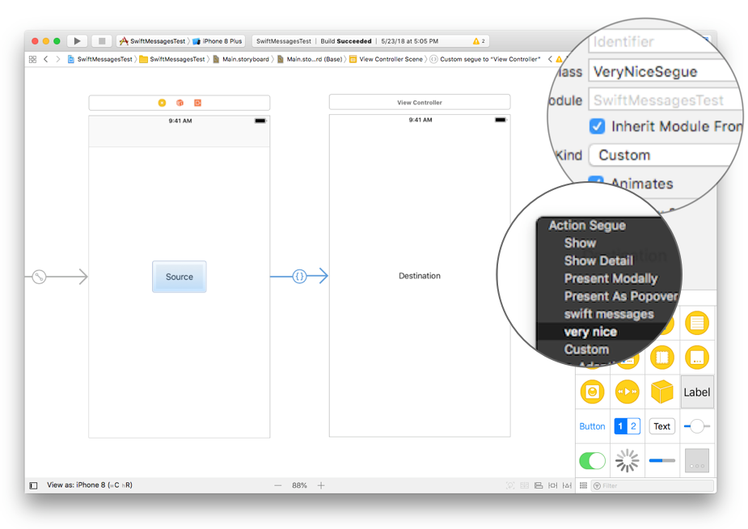

# View Controllers

[`SwiftMessagesSegue`](./SwiftMessages/SwiftMessagesSegue.swift) is a configurable subclass of `UIStoryboardSegue` that presents and dismisses modal view controllers by acting as the presenting view controller's `transitioningDelegate` and utilizing SwiftMessages' `show()` and `hide()` function on the destination view controller's view.

## Usage

### Interface Builder

First, create a segue by control-dragging from the sender element to the destination view controller. Then select "swift messages" (or the name of a `SwiftMessagesSegue` subclass) in the segue type prompt. In the image below, we've created a segue using the `VeryNiceSegue` subclass by selecting "very nice" from the prompt.

<p align="center">
  
</p>

### Programatic

`SwiftMessagesSegue` can be used without an associated storyboard or segue by doing the following in the presenting view controller.

````swift
let destinationVC = ... // make a reference to a destination view controller
let segue = SwiftMessagesSegue(identifier: nil, source: self, destination: destinationVC)
... // do any configuration here
segue.perform()
````

To dismiss, call the UIKit API on the presenting view controller:

````swift
dismiss(animated: true, completion: nil)
````

It is not necessary to retain `segue` because it retains itself until dismissal. However, you can retain it if you plan to `perform()` more than once.

### Configuration

`SwiftMessagesSegue` generally requires configuration to achieve specific layouts and optional behaviors. There are a few good ways to do this:

1. __(Recommended)__ Subclass `SwiftMessagesSegue` and apply configurations in `init(identifier:source:destination:)`. Subclasses will automatically appear in the segue type dialog using an auto-generated name. For example, the name for "VeryNiceSegue" would be "very nice".


    ```swift
    class VeryNiceSegue: SwiftMessagesSegue {
        override public  init(identifier: String?, source: UIViewController, destination: UIViewController) {
            super.init(identifier: identifier, source: source, destination: destination)
            configure(layout: .bottomCard)
            dimMode = .blur(style: .dark, alpha: 0.9, interactive: true)
            messageView.configureNoDropShadow()
        }
    }
    ```


1. Apply configurations in `prepare(for:sender:)` of the presenting view controller after down-casting the segue to `SwiftMessagesSegue`.

    ````swift
    override func prepare(for segue: UIStoryboardSegue, sender: Any?) {
        if let segue = segue as? SwiftMessagesSegue {
            segue.configure(layout: .bottomCard)
            segue.dimMode = .blur(style: .dark, alpha: 0.9, interactive: true)
            segue.messageView.configureNoDropShadow()
        }
    }
    ````

The `configure(layout:)` method is a shortcut for configuring some basic layout and animation options that roughly mirror the options in `SwiftMessages.Layout`.

````swift
// Configure a bottom card-style presentation
segue.configure(layout: .bottomCard)
````

Many more styles can be achieved by customizing the underlying options. Some of the `SwiftMessages.Config` options are useful for view controller presentation and are mirrored on `SwiftMessagesSegue`.

````swift
// Turn off interactive dismiss
segue.interactiveHide = false

// Enable dimmed background with tap-to-dismiss
segue.dimMode = .gray(interactive: true)

// Specify the animation and positioning
segue.presentationStyle = .bottom
````

The `messageView` property provides access to an instance of [`BaseView`](./SwiftMessages/BaseView.swift), the superclass of [`MessageView`](./SwiftMessages/MessageView.swift), that serves as the view presented by SwiftMessages. The view controller's view is contained as a descendant of this view. There are some useful options available on `messageView`:

````swift
// Increase the internal layout margins. With the `.background` containment option,
// the margin additions specify the outer margins around `messageView.backgroundView`.
segue.messageView.layoutMarginAdditions = UIEdgeInsets(top: 20, left: 20, bottom: 20, right: 20)

// Collapse layout margin edges that encroach on non-zero safe area insets.
messageView.collapseLayoutMarginAdditions = true

// Add a default drop shadow.
segue.messageView.configureDropShadow()

// Indicate that the view controller's view should be installed
// as the `backgroundView` of `messageView`.
segue.containment = .background
````

The view controller's view is a direct subview of `containerView`, an instance of [`ViewControllerContainerView`](./SwiftMessages/ViewControllerContainerView.swift), which provides corner rounding options.

````swift
// Change the corner radius
segue.containerView.cornerRadius = 20
````

### Sizing

`SwiftMessagesSegue` provides default view controller sizing based on device, with width on iPad being limited to 500pt max. However, it is recommended that you explicitly specify size appropriate for your content using one of the following methods.
  1. Define sufficient width and height constraints in your view controller such that it sizes itself.
  1. Set the `preferredContentSize` property (a.k.a "Use Preferred Explicit Size" in Interface Builder's attribute inspector). Zeros are ignored, e.g. `CGSize(width: 0, height: 350)` only affects the height.
  1. Add explicit width and/or height constraints to `segue.messageView.backgroundView`.  

Note that `Layout.topMessage` and `Layout.bottomMessage` are always full screen width. For other layouts, the there is a maximum 500pt width on for regular horizontal size class (iPad) at 950 priority. This limit can be overridden by adding higher-priority constraints.

### Keyboard Avoidance

The `KeyboardTrackingView` class can be used to cause the message view to avoid the keyboard by sliding up when the keyboard gets too close.

````swift
segue.keyboardTrackingView = KeyboardTrackingView()
````

You can incorporate `KeyboardTrackingView` into your app even when you're not using SwiftMessages. Install into your view hierarchy by pinning `KeyboardTrackingView` to the bottom, leading, and trailing edges of the screen. Then pin the bottom of your content that should avoid the keyboard to the top `KeyboardTrackingView`. Use an equality constraint to strictly track the keyboard or an inequality constraint to only move when the keyboard gets too close. `KeyboardTrackingView` works by observing keyboard notifications and adjusting its height to maintain its top edge above the keyboard, thereby pushing your content up. See the comments in `KeyboardTrackingView` for configuration options.

See [`SwiftMessagesSegue`](./SwiftMessages/SwiftMessagesSegue.swift) for additional documentation and technical details.
